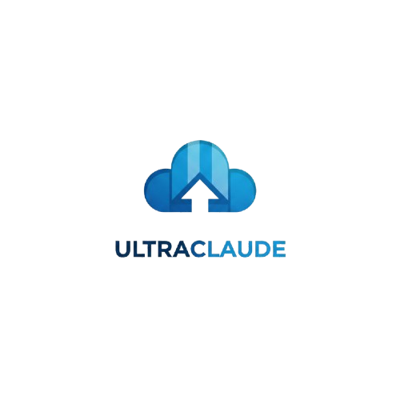

# UltraClaude

<p align="center">
  
</p>

<p align="center">
  <strong>Multi-Session Claude Code Manager with GitHub Integration</strong>
</p>

<p align="center">
  <a href="#features">Features</a> •
  <a href="#quick-start">Quick Start</a> •
  <a href="#installation">Installation</a> •
  <a href="#configuration">Configuration</a> •
  <a href="#usage">Usage</a> •
  <a href="#local-llm-support">Local LLM Support</a>
</p>

---

## Overview

UltraClaude is a powerful web-based interface for managing multiple Claude Code sessions with seamless GitHub integration. It automates the process of working on GitHub issues by creating isolated sessions, managing branches, and generating pull requests automatically.

### Key Capabilities

- **Multi-Session Management**: Run and monitor multiple Claude Code sessions simultaneously
- **GitHub Issue Automation**: Automatically fetch issues, create branches, and submit PRs
- **Real-time Monitoring**: WebSocket-based live output streaming
- **Session Queuing**: Queue sessions to run sequentially with parent-child dependencies
- **Local LLM Support**: Use Ollama, LM Studio, or OpenRouter as alternatives to Claude Code
- **Git Integration**: Automatic repository cloning, branch management, and credential handling

## Features

### Session Management
- Create, start, stop, and monitor Claude Code sessions
- Real-time terminal output via WebSocket
- Session status tracking (running, completed, failed, queued)
- Parent-child session dependencies for sequential workflows

### GitHub Integration
- Link projects to GitHub repositories
- Automatic issue synchronization with filtering
- Branch creation per issue (e.g., `fix/issue-123`)
- Automated PR creation with proper formatting
- Token-based authentication for private repositories

### Automation Engine
- Start automation to process issues automatically
- Configurable verification commands (lint, test, build)
- Retry logic for failed sessions
- Activity logging for debugging

### LLM Provider Support
- **Claude Code** (default): Uses tmux-based Claude CLI
- **Ollama**: Local LLM with tool calling support
- **LM Studio**: OpenAI-compatible local server
- **OpenRouter**: Cloud API for various models (Claude, GPT, Llama, etc.)

## Quick Start

```bash
# Clone the repository
git clone https://github.com/yourusername/ultraclaude.git
cd ultraclaude

# Install dependencies
pip install -r requirements.txt

# Start the server
python -m src.server

# Open in browser
# Navigate to http://localhost:8420
```

## Installation

See [INSTALLATION.md](docs/INSTALLATION.md) for detailed setup instructions.

### Prerequisites

- Python 3.9 or higher
- Claude Code CLI installed (`npm install -g @anthropic-ai/claude-code`)
- tmux (for Claude Code sessions)
- Git (for repository operations)

### Install Dependencies

```bash
pip install -r requirements.txt
```

### Required Python Packages

- `fastapi` - Web framework
- `uvicorn` - ASGI server
- `websockets` - Real-time communication
- `aiofiles` - Async file operations
- `httpx` - HTTP client for LLM APIs
- `jinja2` - Template engine
- `pydantic` - Data validation

## Configuration

See [CONFIGURATION.md](docs/CONFIGURATION.md) for detailed configuration options.

### GitHub Token Setup

1. Go to [GitHub Settings > Developer Settings > Personal Access Tokens](https://github.com/settings/tokens)
2. Click "Generate new token (classic)" or "Fine-grained token"
3. Select the required scopes:

**For Classic Tokens:**
- `repo` - Full control of private repositories
- `workflow` - Update GitHub Action workflows (optional)

**For Fine-grained Tokens:**
- Repository access: Select specific repositories
- Permissions:
  - Contents: Read and write
  - Issues: Read and write
  - Pull requests: Read and write
  - Metadata: Read-only

4. Copy the token and add it to your project settings in UltraClaude

### Project Configuration

1. Click "New Project" in UltraClaude
2. Enter:
   - **Project Name**: Display name for your project
   - **GitHub Repository**: `owner/repo` format
   - **GitHub Token**: Your personal access token
   - **Working Directory**: Local path for git clone
   - **Default Branch**: Usually `main` or `master`

## Usage

### Creating a Project

1. Navigate to the Projects page
2. Click "New Project"
3. Fill in the repository details
4. Save and sync issues

### Starting Automation

1. Select a project
2. Click "Clone Repository" if not already cloned
3. Click "Sync Issues" to fetch GitHub issues
4. Click "Start Automation" to begin processing

### Manual Session Control

1. Go to the Sessions page
2. Click "New Session"
3. Enter the working directory and optional prompt
4. Monitor output in real-time

## Local LLM Support

UltraClaude supports alternative LLM providers for users who want to use local models or different cloud APIs.

### Ollama Setup

1. Install Ollama: https://ollama.ai
2. Pull a model: `ollama pull llama3.2:latest`
3. Start Ollama: `ollama serve`
4. In UltraClaude project settings:
   - Select "Ollama" as the LLM provider
   - API URL: `http://localhost:11434`
   - Model: `llama3.2:latest`

### LM Studio Setup

1. Install LM Studio: https://lmstudio.ai
2. Download a model from the Discover tab
3. Start the local server (enable in settings)
4. In UltraClaude project settings:
   - Select "LM Studio" as the LLM provider
   - API URL: `http://localhost:1234/v1`
   - Model: (auto-detected)

### OpenRouter Setup

1. Get an API key from https://openrouter.ai
2. In UltraClaude project settings:
   - Select "OpenRouter" as the LLM provider
   - API Key: Your OpenRouter API key
   - Model: e.g., `anthropic/claude-3.5-sonnet`

## API Reference

### REST Endpoints

| Method | Endpoint | Description |
|--------|----------|-------------|
| GET | `/api/sessions` | List all sessions |
| POST | `/api/sessions` | Create new session |
| POST | `/api/sessions/{id}/input` | Send input to session |
| POST | `/api/sessions/{id}/stop` | Stop session |
| GET | `/api/projects` | List all projects |
| POST | `/api/projects` | Create new project |
| POST | `/api/projects/{id}/sync` | Sync issues from GitHub |
| POST | `/api/llm/test` | Test LLM connection |
| GET | `/api/llm/ollama/models` | List Ollama models |

### WebSocket

Connect to `/ws` for real-time updates:

```javascript
const ws = new WebSocket('ws://localhost:8420/ws');
ws.onmessage = (event) => {
  const data = JSON.parse(event.data);
  // Handle: init, output, status, session_created
};
```

## Architecture

```
ultraclaude/
├── src/
│   ├── server.py          # FastAPI application
│   ├── session_manager.py # Session lifecycle management
│   ├── models.py          # Data models and persistence
│   ├── automation.py      # GitHub automation engine
│   ├── github_client.py   # GitHub API client
│   ├── llm_provider.py    # LLM provider abstraction
│   ├── agentic_runner.py  # Local LLM agent loop
│   └── tools.py           # Agentic tools for local LLMs
├── web/
│   ├── templates/         # Jinja2 HTML templates
│   └── static/            # CSS and JavaScript
├── data/                  # Persistent storage (auto-created)
└── requirements.txt       # Python dependencies
```

## Troubleshooting

### Common Issues

**"Cannot connect to Ollama"**
- Ensure Ollama is running: `ollama serve`
- Check the API URL in project settings

**"GitHub token invalid"**
- Verify token has `repo` scope
- Check token hasn't expired
- For fine-grained tokens, ensure proper repository access

**"tmux session not found"**
- Install tmux: `apt install tmux` (Linux) or `brew install tmux` (macOS)
- Ensure Claude Code CLI is installed

**"Working directory not found"**
- Click "Clone Repository" in the project detail view
- Verify the path exists and has write permissions

### Logs

Session logs are stored in `data/sessions/` and project data in `data/projects.json`.

## Contributing

See [CONTRIBUTING.md](CONTRIBUTING.md) for guidelines on contributing to this project.

## License

This project is licensed under the MIT License - see the [LICENSE](LICENSE) file for details.

## Acknowledgments

- [Anthropic](https://anthropic.com) for Claude and Claude Code
- [FastAPI](https://fastapi.tiangolo.com) for the excellent web framework
- [Ollama](https://ollama.ai) for local LLM support
